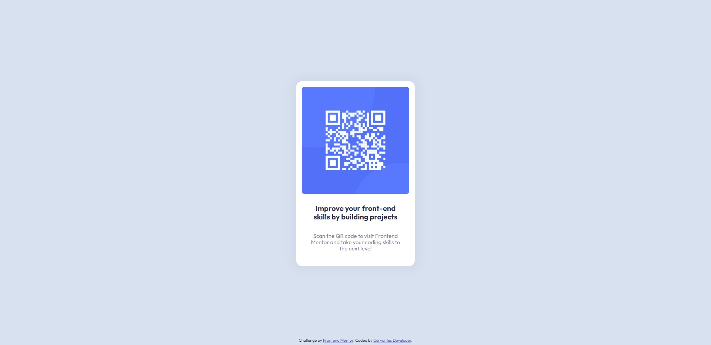

# Frontend Mentor - QR code component solution

This is a solution to the [QR code component challenge on Frontend Mentor](https://www.frontendmentor.io/challenges/qr-code-component-iux_sIO_H). Frontend Mentor challenges help you improve your coding skills by building realistic projects. 

## Table of contents

- [Overview](#overview)
  - [Screenshot](#screenshot)
  - [Links](#links)
- [My process](#my-process)
  - [Built with](#built-with)
  - [Continued development](#continued-development)
  - [Useful resources](#useful-resources)
- [Author](#author)

## Overview

### Screenshot

### Links

- Solution URL: [Add solution URL here](https://github.com/cervantesdeveloper/QR-code-component)
- Live Site URL: [Add live site URL here](https://frontendqrcode.netlify.app/)

## My process

### Built with

- Semantic HTML5 markup
- Normalize
- BEM
- Flexbox

### Continued development

I'm going to study about accessibility attributes, and markup good practices.

### Useful resources

- [Example resource 1](https://en.bem.info/) - This helped me to learn about the BEM methodology.
- [Example resource 2](https://codeguide.co/) - I tried to apply some standards about CSS.

## Author

- Github - [Cervantes Developer](https://github.com/cervantesdeveloper)
- Frontend Mentor - [@cervantesdeveloper](https://www.frontendmentor.io/profile/cervantesdeveloper)
